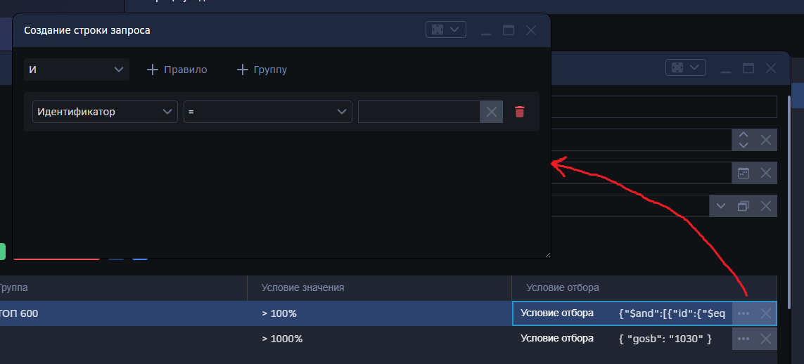
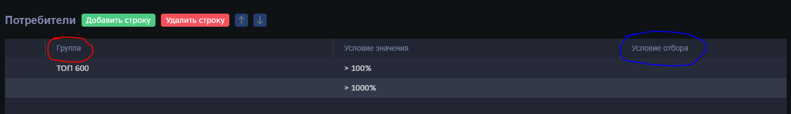
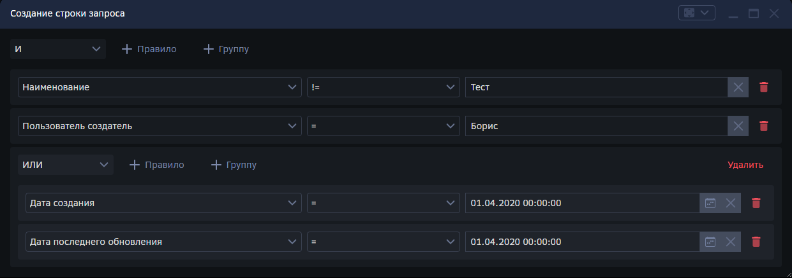

# Компонент `StringBuilder`

## Содержание

1. [Применение и функционал](#component-purpose)
2. [Подключение компонента](#component-props)
3. [Задание условий в интерактивном конструкторе](#edit-conditions)

## 1. Применение и функционал <a id="component-purpose" name="component-purpose"></a>

`Mo.Inputs.StringBuilder` - это компонент в виде строки ввода, который позволяет задавать условия с помощью интерактивного конструктора запросов к БД.



Конструктор позволяет объединять различные условия при помощи операторов "И" или "ИЛИ" (см. подробнее: [Задание условий в интерактивном конструкторе](#edit-conditions)). Результаты сохраняются в виде строки запроса.

## 2. Подключение компонента <a id="component-props" name="component-props"></a>

Компонент может подключаться и в качестве поля в шапку таблицы, так и в качестве ячейки в табличной части.

Пошаговая инструкция:

I. Узнайте имя поля, в котором будет располагаться компонент, а также имя источника в той же табличной части, откуда будут браться свойства для первой части условия. **Источник должен иметь тип списка**. Для шапки аналогично, только имя поля и имя источника будет ссылаться на существующие поля в шапке.



Пример: компонент располагается в поле "Условие отбора", а свойства берёт из поля "Группа".

II. Зайдите в форму в админ-панели.

III. Для подключения компонента в шапке (вкладка "Шаблон формы") добавьте компонент `<Mo.Inputs.StringBuilder />` в шаблон формы, указав в качестве параметра `name` имя поля, и в качестве параметра `fromName` имя поля источника. Также можно добавить опциональный параметр `toName` с указанием поля цели, тогда конструктор запросов будет брать правую часть условия из поля цели.
 
Пример подключения в шапке:

```JSX
<div style={{"height":"100% ","overflowY":"auto"}}>
    <MetadataForms.DataManager
        metaOwner={'[[ metaOwner ]]'} 
        options={[[ options | encodejson ]]} 
    >
        <MetadataForms.Container>
            <MetadataForms.InputsList>
                {this.renderFieldList()}
                <Mo.Inputs.StringBuilder name="УсловиеОтбора" fromName="Инфосервис" />
                {this.renderTabularParts()}
            </MetadataForms.InputsList>
            <MetadataForms.ControlsPanel align="Справа">
                <MetadataForms.Buttons.SaveButton/>
                <MetadataForms.Buttons.CloseButton/>
                <MetadataForms.Buttons.SaveAndCloseButton/>
            </MetadataForms.ControlsPanel>
        </MetadataForms.Container>
    </MetadataForms.DataManager>
</div>
```

IV. Для подключения компонента в таблице (вкладка "Код на клиенте") в компонент `<MetadataForms.TabularPart>` добавьте свойство `overrideFields`. Он принимает список наборов ключ-значение, где - путь к полю, а значение - компонент, который заменяет соответствующую ячейку.

Подключение возможно двумя способами:

1. Указание ключа в виде `{"ТабличнаяЧасть.ИмяПоля": <Компонент />}`.
2. Вложенный объект: `{"ТабличнаяЧасть": {"ИмяПоля": <Компонент />}}`

Пример подключения в таблице первым способом:

```JSX
<MetadataForms.TabularPart
    name={item}
    key={item}
    buttons={[
        <MetadataForms.Buttons.AddRowButton name={"AddRow"}/>,
        <MetadataForms.Buttons.DeleteRowButton name={"DeleteRow"}/>, 
        <MetadataForms.Buttons.MoveRowButtons name={"MoveRow"}/>
    ]}
    overrideFields={{
        "ТабличнаяЧасть.УсловиеОтбора": <Mo.Inputs.StringBuilder name="УсловиеОтбора" fromName="Группа" />,
        //... таким образом можно заменять несколько ячеек
    }}
/>
```

Указание табличной части в параметрах не требуется: информация о таблице передаётся в компонент.

Примечание: поля в `<Mo.Inputs.StringBuilder />` можно записать как в формате "Имя поля", так и в формате "ИмяПоля".

V. Сохраните форму.

## 3. Задание условий в интерактивном конструкторе <a id="edit-conditions" name="edit-conditions"></a>

Конструктор позволяет добавлять, изменять и удалять свои условия. Чтобы добавить новое условие, нажмите на кнопку `+ Правило`. Создаётся набор из трёх полей: первое - список свойств, второе - оператор сравнения (набор зависит от типа поля), третье - значение, которое задаётся в зависимости от типа поля.

Например, задание следующих полей `Дата создания`, `>=`, `01.01.2000` означает, что задано условие "Дата создания больше или равно 1 января 2000".

Все условия объединяются союзом "И" либо "ИЛИ", что задаётся списком в верхнем левом углу конструктора. Но можно создать группу, состоящую из нескольких условий, объединённых под другим союзом.

Для этого применяются *группы*. Нажмите кнопку `+ Группу`, чтобы добавить новую группу.



Группы могут вкладываться друг в друга, что позволяет создавать запросы сколь угодно высокой сложности.